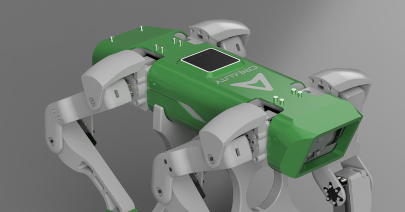

# Spot Micro M5STack edition by 3DEngelen

A small quadruped robot, inspired by boston dynamic [Spot](https://bostondynamics.com/products/spot/).

---

## Introduction

Welcome to my Quadruped Robot project!

It is based on the Spot Micro ESP32 design remix from Michael Kubina, the original design was done by Deok-yeon Kim (KDY0523). (Links can be found in the References)
My version is different in the sense that I am using Heat inserts instead of nuts and bolts for easier assembly and disassembly, as a controller I am using the M5Stack Core2 and M5Stack Servo2 module
The model is designed in Fusion360 and is as complete as possible, including all parts like heat inserts, screws, and electronics.
The controller Software is in progress by will based on the work done by Rune Harlyk Spot Micro ESP32-Leika and Karl-Mills Open Cat ESP32.

---

## References

Here are some resources and inspirations for this project:

- [Original design by Deok-yeon Kim](https://www.thingiverse.com/thing:3445283)
- [SpotMicroESP32 by Michael Kubina](https://github.com/michaelkubina/SpotMicroESP32)
- [Spot Micro - Leika by Rune Harlyk](https://github.com/runeharlyk/SpotMicroESP32-Leika)
- [OpenCat by Karl-Mills](https://github.com/karl-mills/OpenCatEsp32)

Many thanks to the authors for sharing their work, and to the community for the support!

---

## [3D Prints](docs/3D_Prints.md)

To build the quadruped robot, you will need to 3D print several components:

- **Chassis**: The central structure to hold components.
- **Limb Segments**: Multiple parts forming each leg.
- **Cover**: The outer shell for the robot.

All STL files are located on Creality Cloud ()

### Printing Tips

- Use ABS/ASA for the structural parts and TPU for the feet, the covers can be printed in PLA.
- Print settings I recommend using the recommended settings by the Voron Team:
  - Layer Height: 0.2mm
  - Infill: 40%
  - Infill type: Cubic
  - Supports: No - The design is done to prevent the need for supports.
  - Wall Count: 4
  - Top/Bottom Layers: 5
  - Extrusion width: 0.4mm

---

## [Components](Components.md)

Below is the list of components needed to assemble the quadruped robot:

### Electronics

- 12x Servo Motors recommended 35kg(e.g., )
- M5Stack Core2 with Servo2 module
- Battery Pack (18650 2s2p - 7.4V LiPo 5000mA and 20c recommended)

---

## [Assembly](Assembly.md)

---

## [Software](Software.md)

---

Feel free to contribute or share feedback on this project!
